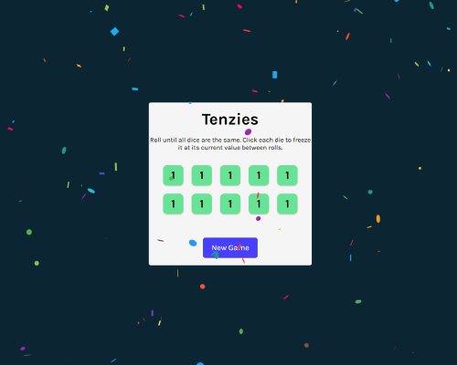

# Tenzies Game

A fun dice game built with React where the goal is to get all dice showing the same number.



## Description

Tenzies is a simple yet addictive game where you roll dice until all of them show the same value. You can click on individual dice to "hold" them between rolls, gradually working towards getting all ten dice to display the same number.

## How to Play

1. Start with a fresh set of 10 dice showing random values from 1 to 6
2. Click on any die to "hold" it at its current value between rolls (held dice turn green)
3. Click the "Roll" button to re-roll all dice that aren't held
4. Continue holding and rolling until all dice show the same value
5. When you win, confetti will appear and the button will change to "New Game"
6. Click "New Game" to reset and play again

## Live Demo

You can play the game here: [https://kvothe1387.github.io/Tenzies/](https://kvothe1387.github.io/Tenzies/)

## Features

- Interactive dice that can be held between rolls
- Visual feedback for held dice
- Celebration animation when winning
- Responsive design that works on mobile and desktop
- Clean, intuitive user interface

## Technologies Used

- React
- Vite
- nanoid (for generating unique IDs)
- react-confetti (for the winning animation)
- CSS Grid for layout

## Local Development

### Prerequisites

- Node.js (version 18 or higher)
- npm or yarn

### Installation

1. Clone the repository:
   ```
   git clone https://github.com/kvothe1387/Tenzies.git
   cd Tenzies
   ```

2. Install dependencies:
   ```
   npm install
   ```

3. Start the development server:
   ```
   npm run dev
   ```

4. Open your browser and navigate to `http://localhost:5173/Tenzies/`

### Building for Production

To build the app for production:

```
npm run build
```

The built files will be in the `dist` directory.

### Deployment

The project is set up for GitHub Pages deployment:

```
npm run deploy
```

This will build the project and publish it to the `gh-pages` branch.

## Future Improvements

- Add a counter to track the number of rolls
- Add a timer to track how long it takes to win
- Add a leaderboard for high scores
- Add difficulty levels (more dice, different shapes)
- Add sound effects

## License

This project is licensed under the MIT License - see the LICENSE file for details.

## Acknowledgments

- This project was created as part of the Scrimba React course
- Built with Vite and React